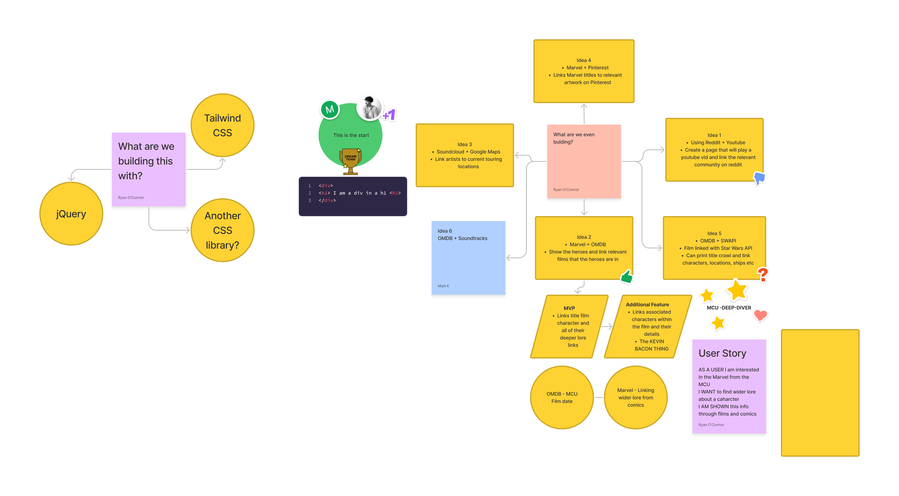
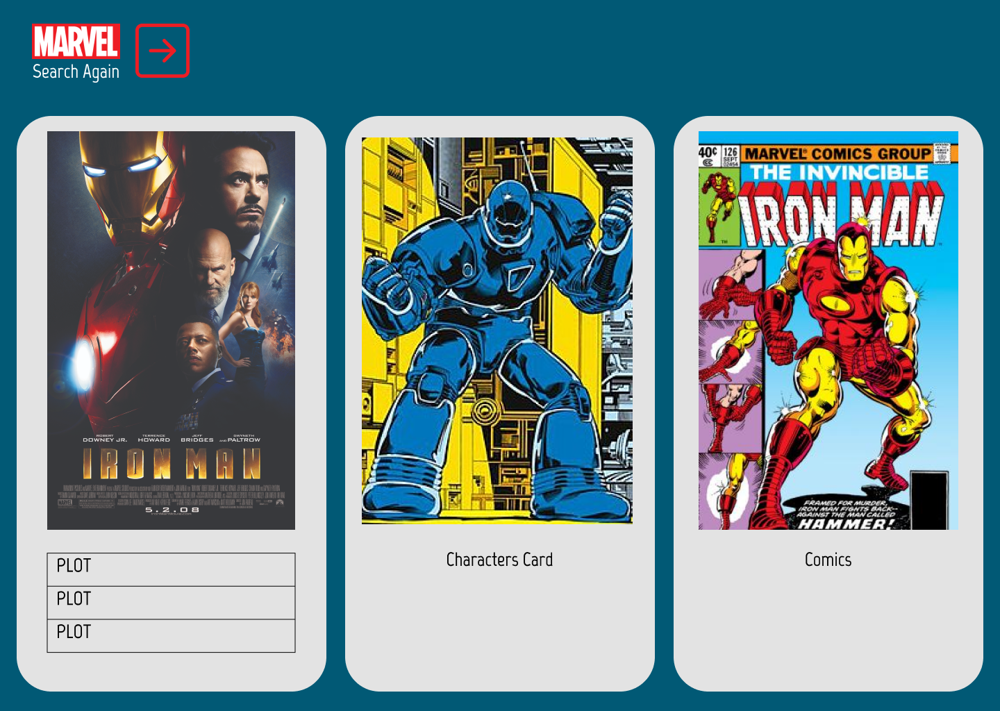

# MCU-deep-diver

## Description
This project was the first major group project for the bootcamp. We were tasked with creating a web app that uses two different API's together in a group of three people. The project needed to be responsive, use client side storage for data a polished UI amongst other criteria. We had to make sure the project doesn't use JS alerts, prompts, or confirms and to use a framework other than Bootstrap.

## Elevator Pitch
Are you an obsessed Marvel fan or are you a complete Marvel beginner and your partner/friends/family are forcing you to watch the films? Have you pretended to not like the films but have secretly started to like them? Would you like to know how deep those characters have reached in comics and films? Then we can make the web app using two API’s for you!

## Concept
The MCU Deep Diver was developed using the OMDB and Marvel API’s. It’s intention was to be able to search for characters in films in the Marvel Cinematic Universe (MCU) and find more about them in the wider lore using the Marvel API to search for comics.

Our motivation for development was aimed at linking casual fans with the wider lore of the Marvel universe both through film and comics.

<!-- screenshot of figma here -->

## Process 

- ### Technologies
We used  HTML, CSS, vanilla Javascript, TailwindCSS, FontAwesome in our project. We also using Insomnia to test our API pulls

- ### Tasks
We had many tasks to complete for this project and broke them down. For example we had to get the API’s functional. Pulling the data we wanted, appending to the page, styling, bug fixing etc

The using javascript to interact with the API’s was the most time consuming during this project as we ran into so many blockers in pulling the data, using the data. In the end to make our comicFetcher function to run we had to run the Marvel API twice with the first time generating the characterID required to pull the comics.

- ### Roles
We broke down the roles by having a driver and then delegating task to each other. We were originally branching individually but then moved to developing on a single dev branch instead. This was a smoother process and we all approved each push so we all worked from the same dev branch to develop at the same time.

- ### Challenges
There were many challenges!

The Marvel API was very difficult to work with despite having no auth process. We found searching a single character would provide lots of detail but we could not iterate through this selection nor would it provide the comic information we wanted. We found we could search for a wider selection of comics using a characterID but the details were lesser. Links and descriptions from this were no longer available despite having more comic options available for viewing.

We had similar challenges with the OMDB API, wider searching removed details such as the plot but we had what we wanted in terms of a wider array of options on the search

<!-- images -->

- ### Successes
We managed to achieve our goal of being able to display a searched character and have comics and films display with that key term. This was pulled from an array of acceptable terms that throws an error if the search doesn’t match a Marvel character.

An odd ‘feature’ of the Marvel API is certain characters don’t exist which is not ideal but we had to work with it!
We used Tailwind to make the design responsive, clean and minimal using a theme throughout. We have left this 'feature' in to show we were aware of it and provide an example of how we found the MarvelAPI difficult to work with.

We stored each search in localstorage and created a Previous search button that will instantly take the user back to the previous search. A load more button iterates through the pulled data to display more cards to the page.

## Future Development

There are many problems we faced which narrowed the development scope of what we could develop - this was mostly within getting the API’s to behave how we wanted!

We would have liked the wider searches to then narrow down to bring back the wider details available. The API’s difficulty to work with limited us and slowed development time down.

We would have liked to link to the wider information available on the Marvel API such as events and series also to really dive deeper into the lore.

Implementing async on the comic search function to make the transition smoother as we realised it is slower to load than the OMDB API search.

Matt - More functionality with the cards and styling edits, additions to the main page design.

Jag - Predictive text on user search to make it easier for the user and potentially prevent the catch error of not search a Marvel character appear.

Ryan - Wider functionality with the cards in terms of interacitivty such as being able to link to other resources. Slick animations when the cards append to the page eg each card dropping in sequentially.

## Special thanks
The debugger  
Rhys  
Tom

## Links
MCU-deep-diver - [Github Repo](https://github.com/Ryocon/MCU-deep-diver)
 
Deployed page - [Github Pages](https://ryocon.github.io/MCU-deep-diver/)

## Demo
 

